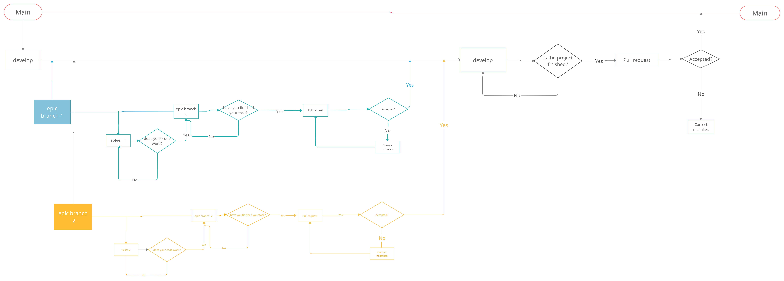

# Taller Git y Github

Taller sobre Git y Github centrado en metodologías ágiles y CI/CD.

### Realizado en The Bridge | Digital Talent Accelerator en noviembre de 2021

- Para conocer más sobre el taller visita este enlace de
[NOTION](https://well-guilty-c59.notion.site/Taller-de-Git-y-Github-728cf8d75a2845b9aa2bea1df5292c78 
)

- Visita el tablero de [Miro](https://miro.com/app/board/o9J_llVyR4k=/?invite_link_id=738393240487)

### Este es el diagrama de flujo con el que se va a trabajar 

Mención especial a [@clapiniella](https://github.com/Clapiniella) por su esfuerzo y su trabajo, sin los cuales este repositorio no tendría sentido.
